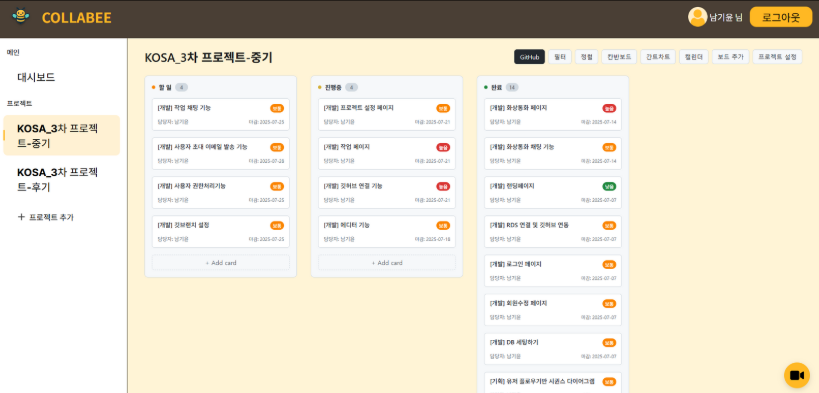
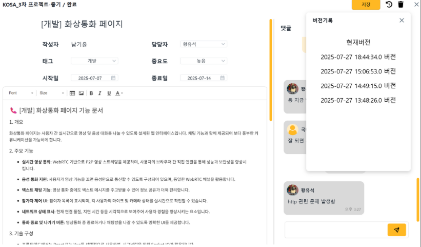
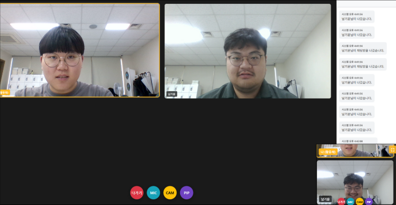
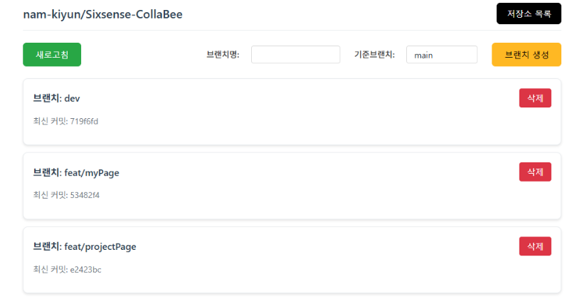

#  COLLABEE

초급 개발자를 위한 일정관리 및 화상통화 플랫폼

## 프로젝트 개요

COLLABEE는 개발 프로젝트 관리와 팀 커뮤니케이션을 위한 웹 기반 플랫폼입니다. 초급 개발자들이 프로젝트를 효율적으로 관리하고 팀원들과 원활하게 소통할 수 있도록 설계되었습니다.

## ABOUT SIXSENSE

오감을 제외한 제 6의 감각으로서 사용자에게 새로운 경험을 제공하는 팀

- 남기윤(팀장) fordnam1@gmail.com
- 황유석(부팀장) swh3190@gmail.com
- 국다인(팀원) dorazi0423@gmail.com

## 주요 기능

### 1. 프로젝트 관리

- 프로젝트 생성 및 관리
- 프로젝트 대시보드
- 프로젝트별 팀원 관리

### 2. 태스크 관리

- 칸반 보드를 통한 태스크 관리
- 태스크 생성, 수정, 삭제
- 우선순위 및 태그 관리
- 드래그 앤 드롭을 통한 태스크 상태 변경

### 3. 일정 관리

- 캘린더 뷰를 통한 일정 확인
- 간트 차트를 통한 프로젝트 진행도 시각화
- 일정 알림 기능

### 4. 화상통화

- WebRTC 기반 실시간 화상통화
- 채팅 기능
- 화면 공유

### 5. GitHub 연동

- GitHub 저장소 연동
- 브랜치 관리
- 웹훅을 통한 실시간 동기화

### 6. 사용자 관리

- 회원가입 및 로그인
- 이메일 인증
- 프로필 관리
- 비밀번호 변경

## 기술 스택

### 백엔드

- **Java 8(1.8)**
- **Spring Framework 5.3.39**
- **MyBatis** - 데이터베이스 매핑
- **Maven** - 의존성 관리
- **WebSocket** - 실시간 통신
- **Proworks 5** - 통합 개발 플랫폼

### 프론트엔드

- **WebSquare** - UI 프레임워크
- **Matrix Mobile** - 모바일 프레임워크
- **JavaScript/HTML/CSS**
- **WebRTC** - 화상통화

### 데이터베이스

- **MariaDB** - 메인 데이터베이스
- **Amazon RDS** - 클라우드 데이터베이스
- **Redis** - 세션 및 캐시 관리

### 인프라 및 배포

- **Amazon EC2** - 클라우드 서버
- **Apache Tomcat** - 웹 애플리케이션 서버
- **Docker** - 컨테이너화
- **Node.js** - smee.io 서비스 이용

### 외부 연동

- **GitHub API** - 저장소 연동
- **Amazon S3** - 파일 저장
- **reCAPTCHA** - 보안 인증

## 프로젝트 구조

```
src/main/
├── java/com/demo/proworks/
│   ├── board/          # 보드 관리
│   ├── comment/        # 댓글 기능
│   ├── email/          # 이메일 기능
│   ├── github/         # GitHub 연동
│   ├── project/        # 프로젝트 관리
│   ├── task/           # 태스크 관리
│   ├── user/           # 사용자 관리
│   ├── videochat/      # 화상통화
│   └── websocket/      # WebSocket 핸들러
├── webapp/
│   ├── ui/
│   │   ├── auth/       # 인증 관련 페이지
│   │   ├── mobile/     # 모바일 UI
│   │   ├── project/    # 프로젝트 관리 페이지
│   │   └── videochat/  # 화상통화 페이지
│   ├── css/            # 스타일시트
│   ├── js/             # JavaScript 파일
│   └── images/         # 이미지 리소스
```

## 스크린샷

### 칸반 보드



### 태스크 관리



### 화상통화



### GitHub 연동



## 주요 컴포넌트

### 1. 칸반 보드 (Kanban Board)

- 드래그 앤 드롭 방식의 태스크 관리
- 실시간 업데이트
- 태스크 필터링 및 정렬

### 2. 화상통화 시스템

- MediaSoup 기반 WebRTC 구현
- 다중 사용자 지원
- 채팅 및 화면 공유

### 3. GitHub 통합

- OAuth 인증을 통한 저장소 연결
- 브랜치 및 커밋 정보 동기화
- 웹훅을 통한 실시간 업데이트
